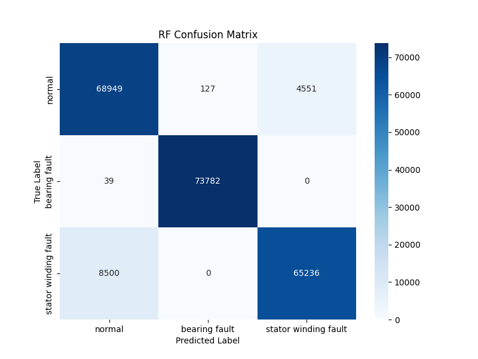
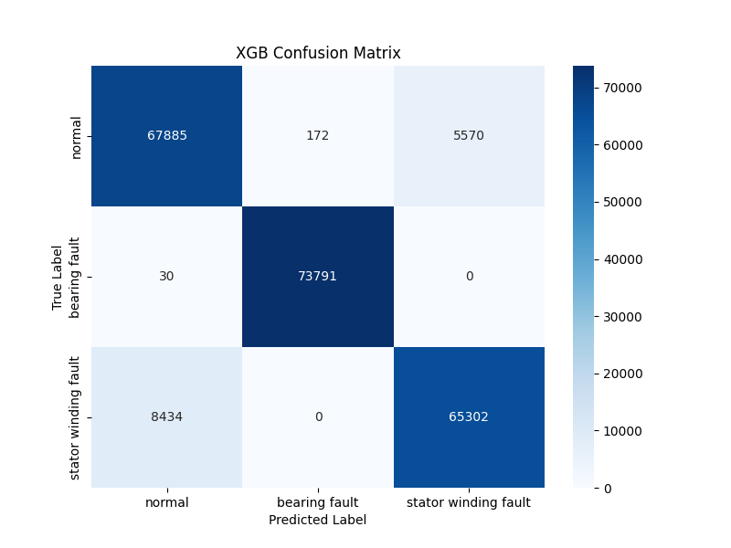
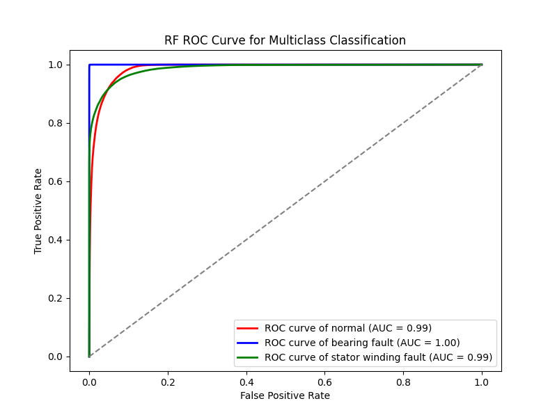
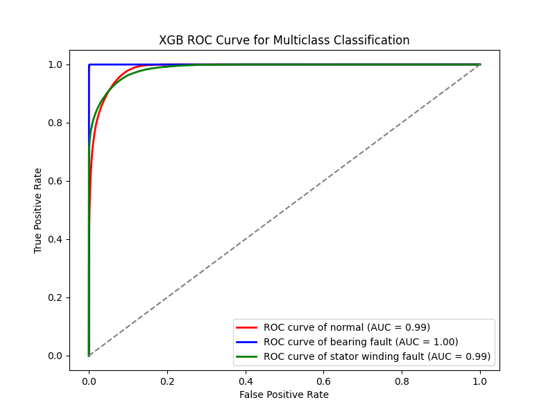

# Induction-Motor-Multi-Incipient-Fault-Detection-based-on-Gradient-Boosting-Algorithms

## Project overview
This repository contains a complete reproducible pipeline for early detection of bearing and stator‐winding faults in three‑phase induction motors using gradient boosting machine algorithms. The workflow follows the experimental methodology described in the paper and demonstrates how current signals are converted into statistical features, balanced, and classified.

## Code structure
* `feature_extraction.py`  
  Reads raw phase‑current samples from a .csv file with three columns for three phases, balances the dataset with SMOTE for all classes, derives first‑order statistics, and saves the feature table.
* `feature_extraction_wavelet.py`  
  Generates wavelet coefficients, selects the most informative ones with mutual information, and produces an alternative feature table.
* `gridsearch.py`  
  Performs exhaustive hyper‑parameter tuning for each candidate model and stores the scores.
* `main.py`  
  Trains the chosen classifiers, reports metrics, and automatically plots confusion matrices and ROC curves.
* `testing.py`  
  Utility script for quick visual sanity checks of the processed features.

All scripts assume the presence of a `datasets` folder (not included) with the three raw Excel files described in the paper.

## Dataflow
1. Raw phase‑current measurements collected at 12 kHz for normal, bearing‑fault, and stator‑winding‑fault conditions.
2. Synthetic Minority Over‑sampling Technique (SMOTE) to equalise class distribution.
3. Feature extraction: mean, variance, standard deviation, skew, covariance and optional wavelet detail coefficients.
4. Train‑test split followed by 5‑fold cross‑validation.
5. Model training and evaluation with Gradient Boosting, CatBoost, LightGBM, XGBoost, Random Forest, and K‑Nearest Neighbours.
6. Metric reporting and figure export.

## Results
The table below reproduces the main findings of the paper after grid search and 5‑fold cross‑validation on the statistical‑feature dataset.

| Model | Accuracy | Precision | Recall | F1 | Runtime (min) |
| --- | --- | --- | --- | --- | --- |
| Random Forest | 0.94 | 0.94 | 0.94 | 0.94 | 45.0 |
| XGBoost | 0.94 | 0.93 | 0.93 | 0.93 | 4.9 |
| LightGBM | 0.92 | 0.92 | 0.92 | 0.92 | 0.35 |
| CatBoost | 0.93 | 0.93 | 0.93 | 0.93 | 460.7 |
| Gradient Boosting (sklearn) | 0.87 | 0.87 | 0.87 | 0.87 | 118 |
| KNN | 0.87 | 0.87 | 0.86 | 0.86 | 1.6 |

### Confusion matrices



### ROC curves



The ROC curves show near‑perfect separability with area under the curve values close to 1.0 for all three classes, confirming that current‑signal statistics carry sufficient information for reliable fault discrimination.

## Inputs and outputs
* **Input**: Three‑phase stator currents in CSV/Excel format.
* **Output**:  
  * `datasets/dataset.csv` – balanced statistical feature table  
  * Trained model objects (optional, via joblib)  
  * Figures in `results/<model>`  
  * Metric CSV files in `results/metrics`

## How to reproduce
```
pip install -r requirements.txt
python feature_extraction.py
python main.py
```
Replace the dataset paths as needed.

## Citation

If you find this repository useful, please cite the original article:

> R. Hussain, M. AlShaikh Saleh, and S. S. Refaat, "Induction Motor Multi Incipient Fault Detection based on Gradient Boosting Algorithms," *Proceedings of the 50th Annual Conference of the IEEE Industrial Electronics Society (IECON 2024)*, Chicago, USA, 2024, doi: 10.1109/IECON55916.2024.10905593.

